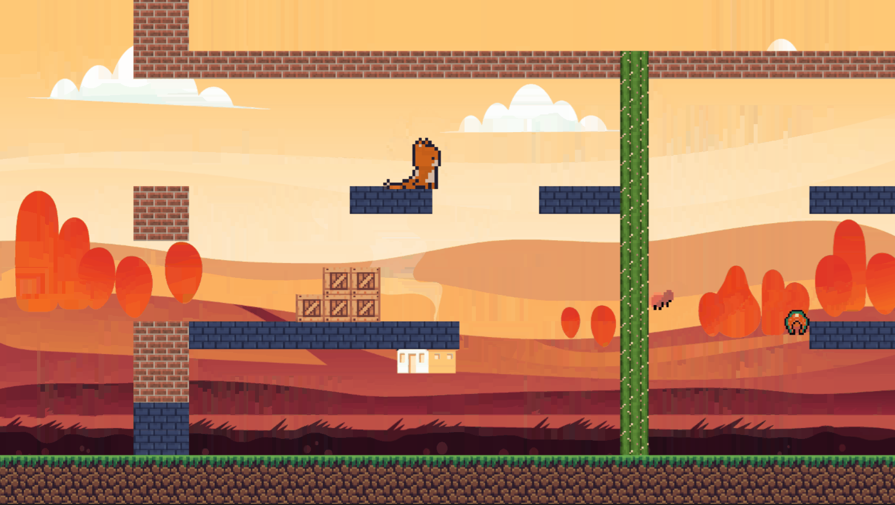

### Hi there! 👋 I'm Arune

I'm a passionate game and web developer who loves turning creative ideas into interactive experiences. Welcome to my GitHub profile! 

🎮 **Game Development:** Coding is great, but coding games is way beyond. Recently I have been learning game development with C++ and PlayBuffer framework. You'll find a collection of my game projects I  created so far [here].

🌐 **Web Development:** I'm also a graduate of Web Development bootcamp, where I learned HTML, CSS, JavaScript, React, database management with MongoDB and how to build servers with Node.js and Express. You can explore some of my web projects [here].

🔧 **Skills:** Some of the tools and technologies I work with include:

  

<!--  -->

🌱 **I’m currently learning:** C++ and game development secrets.

🚀 **What I'm Currently Working On:** I'm currently working on my first Platform2D game.

🌟 **Highlights:**

[Sky High Spyder](https://github.com/mspaprika/Sky-High-Spyder)
 

[Cat & Fleas](https://github.com/mspaprika/Platform-2D-Game-)
 

📫 **Let's Connect:**
- LinkedIn: [Your LinkedIn Profile URL]
- Portfolio Website: [Your Portfolio Website URL]
- Twitter: [Your Twitter Profile URL]
- Email: [Your Email Address]

Feel free to explore my repositories and reach out if you have any questions or collaboration ideas. I'm always open to new challenges and exciting projects!

🎮 Let's create amazing games and build awesome web experiences together! 🌐

<!--
**mspaprika/mspaprika** is a ✨ _special_ ✨ repository because its `README.md` (this file) appears on your GitHub profile.

Here are some ideas to get you started:

- 🔭 I’m currently working on ...
- 🌱 I’m currently learning ...
- 👯 I’m looking to collaborate on ...
- 🤔 I’m looking for help with ...
- 💬 Ask me about ...
- 📫 How to reach me: ...
- 😄 Pronouns: ...
- ⚡ Fun fact: ...
-->
