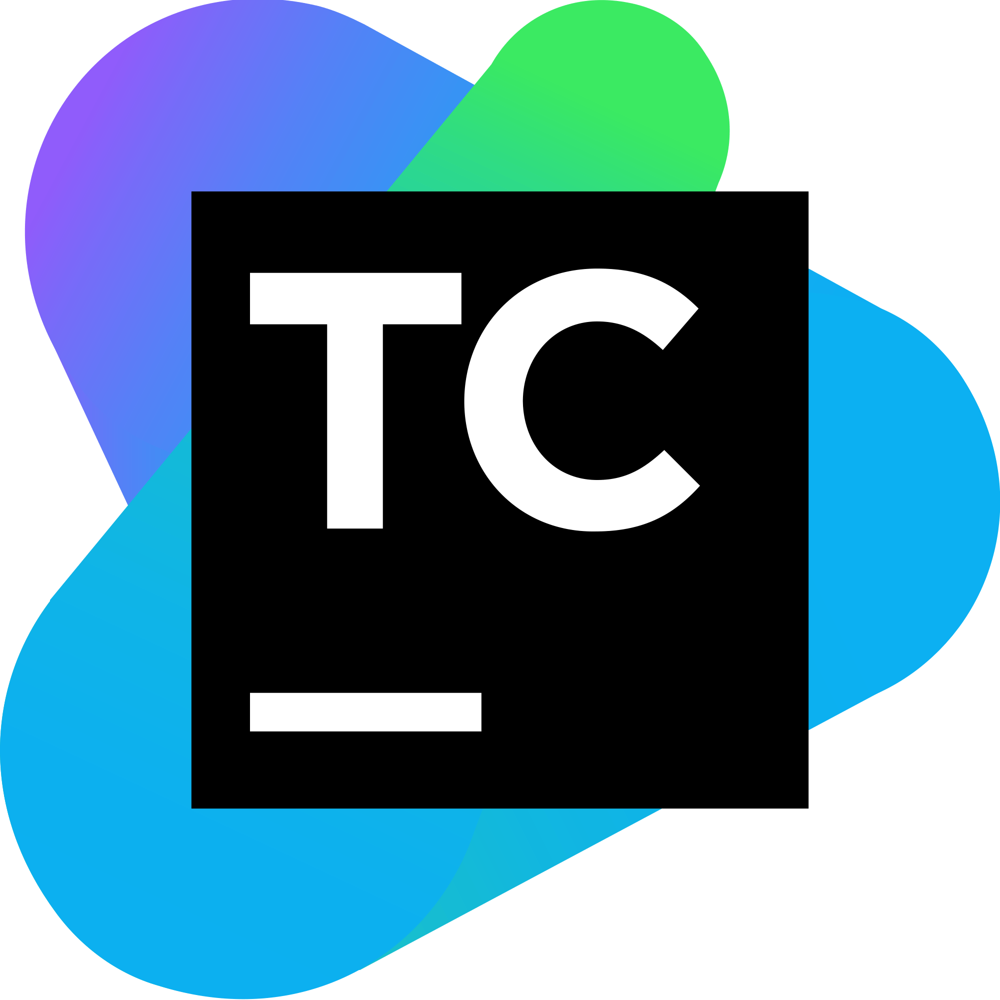
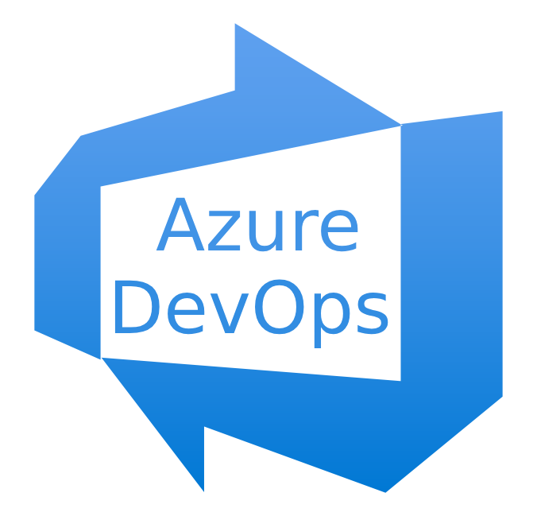
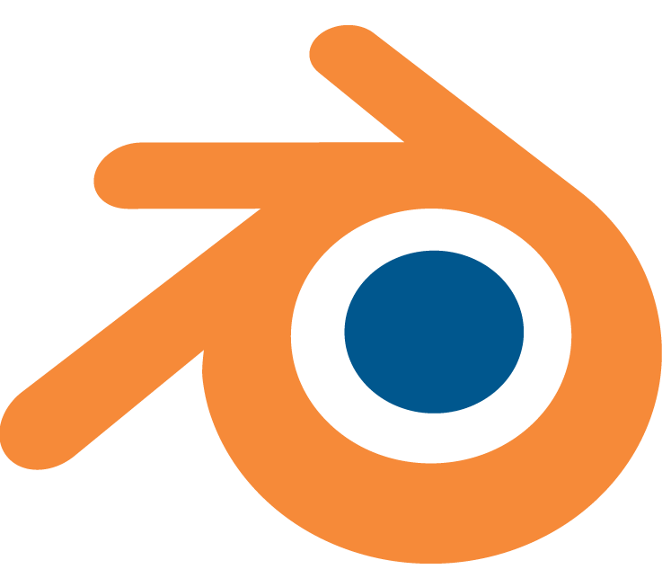
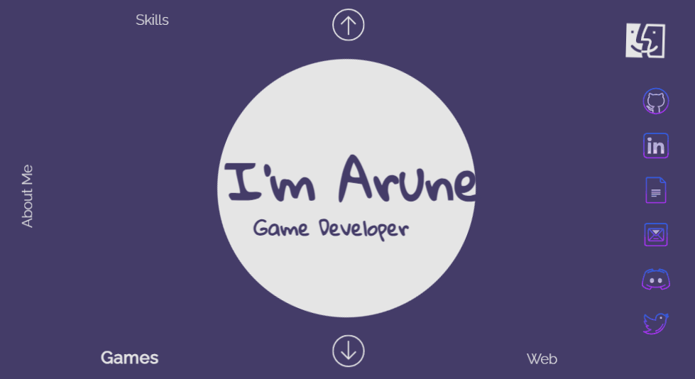

# Hi there! 👋

I've been learning to code for a while now and have created some cool and exciting projects. Welcome to my GitHub profile!
 
 
🎮 **Game Development:** Coding is great, but coding games is way beyond. Recently I have been learning proffesional game development with Unreal Engine, and you'll find a collection of my game projects I created so far [here](https://github.com/mspaprika?tab=repositories).
 
 
🌐 **Web Development:** I'm also proud graduate of Web Development bootcamp, where I learned HTML, CSS, JavaScript, React, also backend management with MongoDB, Node.js and Express. You can explore some of my web projects [here](https://github.com/mspaprika?tab=repositories).
 
 
🔧 **Skills:** Some of the tools and technologies I work with include:
 
 

   
   
   
   
   
   
   
   
   
   
   
   
   
   
   
   
   
   

🌱 **I’m currently learning:** C++ and game development secrets.

🚀 **I'm Currently Working On:** Cat Cafe Horror in Unreal 5 [let's see!](https://github.com/mspaprika/CatCafe).

🌟 **Highlights:**

## 🍄‍🟫🍄🐈 Cat Cafe 🐈🍄🍄‍🟫

 
 

## 🪐🌍 Brightside 🪐👽

 
 

## 🌌👽🚀 Sky High Spyder 🕷️

 
 

## 🐈 Cat & Fleas 🦟

 
 

📫 **Let's Connect:**
 
 

 
 

## ⚡ Portfolio Website:

 
 

Feel free to explore my repositories and reach out if you have any questions or collaboration ideas. I'm always open to new challenges and exciting projects!

<!--
**mspaprika/mspaprika** is a ✨ _special_ ✨ repository because its `README.md` (this file) appears on your GitHub profile.

Here are some ideas to get you started:

- 🔭 I’m currently working on ...
- 🌱 I’m currently learning ...
- 👯 I’m looking to collaborate on ...
- 🤔 I’m looking for help with ...
- 💬 Ask me about ...
- 📫 How to reach me: ...
- 😄 Pronouns: ...
- ⚡ Fun fact: ...
-->
